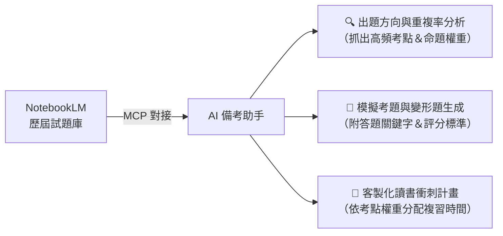

# 國考歷屆試題 × NotebookLM MCP 知識庫分析助手

> **專案性質**：個人 POC 技術驗證專案（Private）  
> **核心架構**：公開試題下載 ➔ 格式整理 ➔ **NotebookLM MCP 知識庫對接** ➔ **三合一備考助手（考點分析／模擬出題／讀書計畫）**

---

> [!IMPORTANT]
> ### ⚠️ 重要前提：必須安裝 NotebookLM MCP
> 本工作流的核心設計是**將動輒數百頁的歷屆試題 PDF 交由 NotebookLM 閱讀與檢索，Agent（Claude / Antigravity）則透過 `NotebookLM MCP` 與線上筆記本無縫對接，進行精準提問、考點分析與引註驗證**。
>
> 若未安裝與設定 NotebookLM MCP，Agent 將無法直接讀取線上筆記本的題目內容。**請務必先完成下方 MCP 安裝設定！**

---

## 🎯 三大核心備考功能（本專案價值）

準備國家考試與專業證照最怕「抓不到重點盲目苦讀」。本專案結合 NotebookLM 知識庫與 Agent 提示詞，實現三大實戰功能：



### 1. 🔍 出題方向與重複率分析（鎖定準備重點）
* **考點重複率統計**：分析歷年試題中哪些概念、條文或工法重複出現頻率最高（例如近 5 年出現 3 次以上之必考題）。
* **命題趨勢縱覽**：分析新修法規、新興議題在近期考題中的出題比率與出題型態轉變。
* **分科重點權重排行**：依據重複率排出各章節優先準備順序，避免將時間浪費在極低頻冷門考點。

### 2. 📝 AI 模擬考題與變形題生成（實戰測驗）
* **同型變形題演練**：從 NotebookLM 抓取歷屆經典考題，自動抽換參數、情境或法規條件生成「變形模擬題」。
* **申論/計算題實戰模擬**：生成標準國考格式之模擬試卷（配分 20~25 分題型）。
* **評分標準與關鍵字檢核**：每道題目均附帶「標準答題架構」、「必備法條/公式關鍵字」與「評分要點（Rubric）」。

### 3. 📅 客製化讀書計畫與衝刺排程（時間最佳化）
* **考點權重反推排程**：依據出題重複率與考科難易度，自動計算各科目與章節應分配的研讀時數。
* **階段性複習計畫**：
  * **第一階段（基礎打底）**：掌握 80% 高頻基本考點。
  * **第二階段（專題破關）**：精熟變形題與跨章節綜合題。
  * **第三階段（考前衝刺）**：最後 30 天/兩週每日模擬考與避坑清單。
* **個人弱點動態調整**：考生可輸入自身弱項，AI 即刻重算並產出修正後的每週讀書行事曆。

---

## 💡 AI 提示詞範本（Prompt Templates）

完成 MCP 串接後，可直接在 Agent 輸入以下指令：

### 範例 A：分析出題頻率與重點
```text
請透過 NotebookLM MCP 讀取歷屆試題筆記本，分析近 5 年出題頻率最高的 TOP 10 核心考點，並依「出現次數」、「對應章節/法規」及「準備優先級」整理成比較表格。
```

### 範例 B：生成模擬考題
```text
請根據筆記本中的歷屆試題，挑選「建築結構」與「施工法規」最常考的兩大題型，各出 1 題全新的 25 分申論模擬題，並附上評分標準與必備關鍵字。
```

### 範例 C：產出 60 天衝刺讀書計畫
```text
距離考試還有 60 天，我每天可讀書 4 小時。請依據筆記本中各科目的出題權重與重複率，為我規劃一份 60 天的三階段讀書計畫行事曆。
```

---

## 🛠️ NotebookLM MCP 安裝與設定步驟

### 步驟 1：安裝 NotebookLM MCP Server
套件為 PyPI 上的 **`notebooklm-mcp-cli`**（同時提供 MCP server `notebooklm-mcp` 與認證工具 `nlm`）：

```bash
# 使用 pip 安裝
pip install notebooklm-mcp-cli

# 或使用 uv 安裝 (推薦)
uv tool install notebooklm-mcp-cli
```

安裝完成後確認執行檔正常可用：
```bash
notebooklm-mcp --version
```

### 步驟 2：Google 帳號認證登入
```bash
nlm login
```
*系統會自動開啟瀏覽器引導您完成 Google 帳號登入（請登入持有該 NotebookLM 筆記本的帳號）。*

### 步驟 3：註冊 MCP Server 至 Agent 環境

#### 方式 A：Claude Code CLI 註冊
```bash
claude mcp add notebooklm-mcp --env NOTEBOOKLM_HL=zh-TW -- notebooklm-mcp
```

#### 方式 B：手動加入設定檔 (`~/.claude.json` 或 `claude_desktop_config.json`)
在 `mcpServers` 區塊中加入：
```json
{
  "mcpServers": {
    "notebooklm-mcp": {
      "type": "stdio",
      "command": "notebooklm-mcp",
      "args": [],
      "env": {
        "NOTEBOOKLM_HL": "zh-TW"
      }
    }
  }
}
```

---

## 🚀 腳本執行流程

### 1. 安裝 Python 依賴套件
```bash
pip install requests beautifulsoup4 pypdf
```

### 2. 執行公開試題下載
```bash
python scripts/download_exams.py --start 110 --end 115 --category "高考三級" --dept "建築工程"
```

### 3. (選用) 考卷雙面列印合併（奇數頁自動補白）
```bash
python scripts/merge_exams.py --input-dir "./data" --output "歷屆試題_雙面列印版.pdf"
```

---

## ⚖️ 合法性與技術說明

* 依中華民國《著作權法》第 9 條第 1 項第 5 款規定，**「依法令舉行之各類考試試題及其備選試題，不得為著作權之標的」**。本工具僅作為個人研讀及技術驗證之用。
* PDF 試題檔案與暫存目錄（`data/`、`*.pdf`）已由 `.gitignore` 排除，避免 repo 過度肥大。

---

## 📅 版本歷程
* **v1.3 (2026-08-20)**：新增 **三大核心備考功能（出題方向與重複率分析、AI 模擬出題、客製化讀書計畫）** 與 Prompt 範本。
* **v1.2 (2026-08-20)**：泛化專案說明為通用國考試題知識庫分析架構，去識別化並補充法規依據。
* **v1.1 (2026-08-20)**：新增 **NotebookLM MCP 必要安裝與設定指引**。
* **v1.0 (2026-08-20)**：建立 POC 專案骨架、試題下載腳本與雙面列印合併工具。
